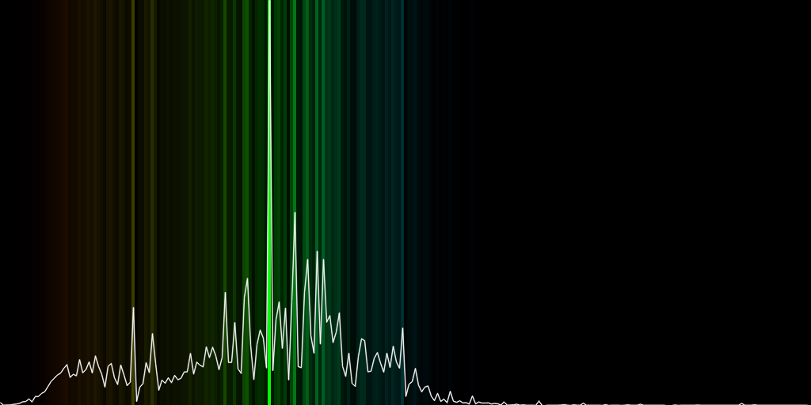

# Video analysis

### Prerequisites
- c++
- OpenCV
- TBB

### Color Analysis
To represent most prominent colors in a video we use a color spectrum and a graph. 
We chose to analyze colors in HSL color space. Unlike RGB it conveniently gives us hue, saturation and luminance(or lightness) - 3 qualities that are convenient and human-friendly. With HSL we could easily dissect the hues of the colors from their properties i.e. light blue, dark blue and blue have the same hue but different luminance and saturation, which helps us accomplish our mission, determine the promimence of different colors in a video. 

We have two properties to deal with -- saturation and lightness. With saturation it is simple, the more saturated the color the more eye-catchy it is. With lumimance it aslo quite easy, the most promiment colors are at the 50%, as with the luminance increase colors get more white, washed-out and with the decrease tehy get darker. These ideas are combined in a [habr post by akurilov](https://habr.com/ru/post/524978/), where he provides the formula for the "weight" of the color:
> W (S, L) = S * (0.52 - (0.5 - L)2) / 0.52

### Results
As a result we provide a color spectrum, where the graph represents the promimence of the colors, and the higher the hue the more saturated it is.

The Matrix(1999) with its notoriously green color scheme also seeems to be adequately represented by [the trailer's](https://www.youtube.com/watch?v=m8e-FF8MsqU) color scheme.

Ridley Scott's The Martian(2015) depicts breathtakingly marvelous scenery of the red planet, and a warm color palette with subtle blueish accents masterfully accompanies the film. (There's also a narrow but promiment green spike on the graph due to [the trailer's](https://www.youtube.com/watch?v=ej3ioOneTy8&t=97s) opening screen)

The Joker

[3Bule1Brown's video](https://www.youtube.com/watch?v=fNk_zzaMoSs&t=4s) about vectors. 

[Термінове звернення президента України Володимира Зеленського 22.02.2022](https://www.youtube.com/watch?v=xKJtI_Vw8Rw) 

## Team
- [Bronytskyi Mykhailo]
- [Dutka Ostap](https://github.com/Ostap2003)
- [Hanyk Ustym](https://github.com/UstymHanyk)
- [Hentosh Petro](https://github.com/PHentosh)

